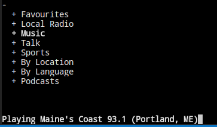

# Docker Radio

Listen to Radio through Docker :notes: :headphones: using [curseradio](https://github.com/chronitis/curseradio)



```bash
docker run -it \
    --device /dev/snd \
    -e PULSE_SERVER=unix:${XDG_RUNTIME_DIR}/pulse/native \
    -e DISPLAY=$DISPLAY -v /etc/localtime:/etc/localtime \
    --group-add $(getent group audio | cut -d: -f3) \
    -v ${XDG_RUNTIME_DIR}/pulse/native:${XDG_RUNTIME_DIR}/pulse/native \
    -v "/tmp/.X11-unix:/tmp/.X11-unix" \
    -v "/dev/dsp:/dev/dsp" \
    richjs/radio
```


Key(s) | Command
-------|--------
<kbd>↑</kbd>, <kbd>↓</kbd> | navigate
<kbd>PgUp</kbd>, <kbd>PgDn</kbd> | navigate quickly
<kbd>Home</kbd>, <kbd>End</kbd> | to top/bottom
<kbd>Enter</kbd> | open/close folders, play stream
<kbd>k</kbd> | stop playing stream
<kbd>q</kbd> | quit
<kbd>f</kbd> | toggle favourite